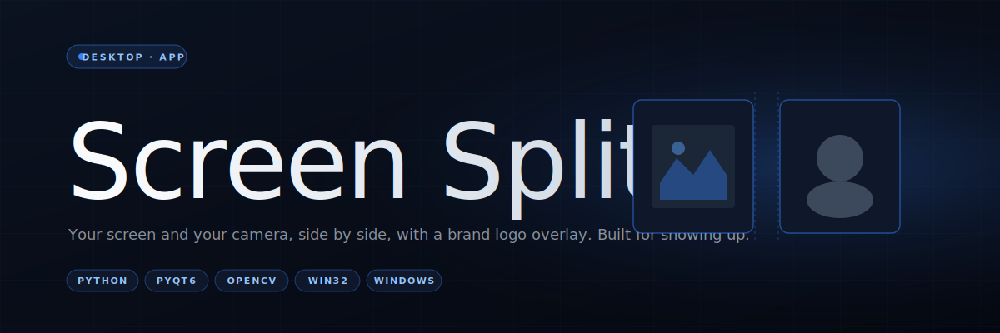

<div align="center">
  
</div>

<p align="center">
  
  
  
  
  
</p>

<br/>

> **Screen Split** is a Windows desktop app that puts your screen and your webcam side-by-side in one tidy, resizable window — with a brand-logo overlay on top. Built for creators who want to record voiceover reactions, tutorials, or personality-forward demos without wrestling with OBS.

<br/>

## What it does

- **Screen capture from any display** — pick the monitor, pick a region, done.
- **Webcam feed with zoom and panning** — your face, where you want it, at the size you want it.
- **Brand-logo overlay** with its own zoom and placement controls — stays on top of both panels.
- **Resizable split window** — drag the divider, snap between horizontal/vertical splits, go fullscreen.
- **Dark-theme native UI** — clean, intentional, the way a desktop app should look in 2026.
- **Smooth animations** for window transitions so the thing feels built, not cobbled.

<br/>

## Download & install

The fastest path for non-developers is a packaged release.

### Prebuilt installer

Grab the latest from the [releases page](https://github.com/KezLahd/Screen-Split/releases) and run it. Windows will handle the rest.

### From PyPI

```powershell
pip install screen-split-app
screen-split
```

### From source

```powershell
git clone https://github.com/KezLahd/Screen-Split.git
cd Screen-Split
pip install -r requirements.txt
python screen_split_app/main.pyw
```

<br/>

## Requirements

| | |
|---|---|
| **OS** | Windows 10 or later |
| **Python** | 3.8+ |
| **Webcam** | Any DirectShow-compatible device |
| **GPU** | Not required — runs comfortably on integrated graphics |

<br/>

## The stack

| Layer | Library |
|---|---|
| UI framework | **PyQt6** — native Windows widgets, high-DPI aware |
| Screen capture | **mss** — zero-copy screen grabs, fast enough for real-time preview |
| Camera | **OpenCV** (`opencv-python`) — webcam feed with zoom/pan on the image matrix |
| Windows integration | **pywin32** — window enumeration, icon extraction, shell glue |
| Compute | **NumPy** — pixel math for the logo compositing path |

Everything fits in a single module (`screen_split_app/main.pyw`) — around 2,800 lines of PyQt + frame-loop glue. No virtual DOMs, no build step, just a Python process.

<br/>

## How it's wired

```
┌──────────────────────────────────────────────────────────────┐
│                         QMainWindow                          │
│  ┌────────────────────┐        ┌────────────────────────┐    │
│  │  Screen capture    │        │  Webcam capture        │    │
│  │  (mss.mss + timer) │        │  (cv2.VideoCapture)    │    │
│  │         │          │        │         │              │    │
│  │         ▼          │        │         ▼              │    │
│  │   QImage frame     │        │   QImage frame         │    │
│  │         │          │        │         │              │    │
│  │         └────┬─────┴────┬───┘         │              │    │
│  │              ▼          ▼             │              │    │
│  │     ┌──────────────┐  ┌──────────────┐│              │    │
│  │     │  QSplitter   │◀─┤  Logo layer  │◀──────────────┘    │
│  │     │  (resizable) │  │ (QPixmap alpha)                   │
│  │     └──────────────┘  └──────────────┘                    │
│  └──────────────────────────────────────────────────────────┘
```

Two producer threads push frames into Qt via `pyqtSignal`; the UI thread paints. `mss` is the thing that makes this smooth — it's single-digit milliseconds per screen grab even at 4K, which leaves headroom for the webcam pipeline and the logo composite.

<br/>

## Project layout

```
Screen-Split/
├── screen_split_app/
│   ├── __init__.py
│   └── main.pyw          The whole app — one module, deliberately
├── requirements.txt      Runtime deps
├── setup.py              Packaging config (PyPI name: screen-split-app)
├── version.txt           Single source of truth for the installer version
├── update.bat            One-click update script for packaged users
└── README.md             This file
```

<br/>

## Building an installer

```powershell
pip install pyinstaller
pyinstaller --onefile --windowed screen_split_app/main.pyw
```

The packaged installer that ships on the releases page is built via a GitHub Actions workflow triggered on tag push.

<br/>

## Why I built this

Because OBS is overkill for most reaction-style recordings and under-featured for the specific thing I wanted — a webcam that stays pinned in a predictable place, a brand-mark I can drop on without re-configuring three panels, and a native feel I didn't get from browser-based tools. The landing page at **[screensplit.kieranjackson.com](https://screensplit.kieranjackson.com)** goes into the "who it's for" angle in more detail.

<br/>

## License

MIT. See [LICENSE](./LICENSE). Use it, ship it, fork it — all I ask is attribution if you build on top of it.

<br/>

---

<p align="center">
  <sub>Built by <a href="https://github.com/KezLahd">Kieran Jackson</a> · <a href="https://screensplit.kieranjackson.com">screensplit.kieranjackson.com</a></sub>
</p>
